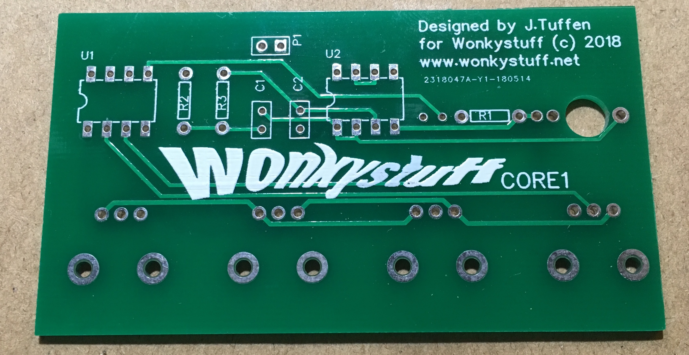

# WonkyStuff Core1 Assembly Instructions

Thanks for buying the WonkyStuff **core1** board. The **core1** is designed as a simple audio generation device which can be reprogrammed. There are four controls (the function of which will depend on the programming) and a single, mono, audio output. The **core1** is designed to run from 4.5v - applying any more is likely to cause damage to the chips (the other components will be fine).

_These instructions are a work in progress. If they are unclear, or there are any mistakes, or you just want to say 'hello', please email us at info@wonkystuff.net, or message us via facebook or twitter._

There is a basic requirement that your soldering skills are up to scratch (I'm sure they are). If you need a reminder, you could do worse than to take a look at this soldering tutorial over at adafruit.com: https://learn.adafruit.com/adafruit-guide-excellent-soldering/

## Parts List

Before starting, make sure that you have all of the parts listed below. The chips are not big fans of static electricity, so take care when handling them (they're quite robust in our experience, but take care nonetheless).

| Label  | Part | Description |
| ------ | ---- | ----------- |
| U1 | ATTiny85-20  | Main processor (pre-programmed as _dr1a_) |
| U2 | MCP6002  | Dual Op-Amp |
| U3 | n/a | Not yet used |
| VR0-3 | 10k Potentiometer x4 | Interaction!|
| R1 | n/a | Not yet used |
| R2 | 15k | Resistor (brown/green/black/red/brown stripes) |
| R3 | 8.2k | Resistor (grey/red/black/brown/brown stripes) |
| C1 | 1nF | Capacitor (marked 102) |
| C2 | 470pF | Capacitor (marked 471) |
| P1 | Power connector | apply 4.5v here |
| J1 | 3.5mm jack | Audio Output |
| B1 | Battery pack | Takes 3 AAA batteries (not included) |
| - | 2 IC sockets | |
| - | PCB | a double-sided Printed Circuit Board |

You'll also need a soldering iron, some solder, a pair of wire cutters and a space to work in.

## Assembly

**Core1** requires components to be placed on both sides of the PCB, the white text/outline will indicate the correct placing of each component.

The general procedure with the assembly is to work in component-height order, so, let's start! For reference, I made a video of the construction of the very first PCB, so check that out if you like: [https://youtu.be/tEjMu7_i6po]

In each case, the component body should more-or-less fit within its white outline on the PCB. Components should be added from this side, and the board flipped over for soldering. Some components (resistors and capacitors) will need their legs clipping once they have been soldered.

* Position the PCB so that the _Designed by…_ text is uppermost:
    
    1. Insert resistors R2 and R3 into the PCB. The legs of these should be bent at 90 degrees such that they line up with the holes in the PCB. Turn the board over (making sure that the resistor body remains flat on the PCB), solder the wires which are protruding through, and then cut off the excess wire.

    1. Insert C1 and C2 into the PCB. The legs should line up easily with the holes in the PCB. Turn the board over (making sure that the resistor body remains flat on the PCB), solder the wires which are protruding through, and then cut off the excess wire.

    1. Solder the two IC sockets into positions U1 and U2, taking care to match the notch in the socket with the symbol on the PCB. Again, turn the board over for soldering -- it's easier to do these one at a time to keep the sockets from falling out of the board when it is flipped.

    1. Solder the power connector so that it protrudes over the edge of the PCB. It's very important that this is placed on the correct side of the PCB as the battery pack is already wired with a socket to fit this orientation.

For reference, the PCB should now look something like this:

* Turn over the PCB:

    1. Insert the audio jack into the PCB - take care that the pins go into the correct holes (and not into the hole for R1). Turn the board over and solder the pins.
    2. In turn, insert the four potentiometers into place (the large tabs may need a slight squeeze for them to go into the holes correctly). Once inserted, turn the board over for soldering. The tabs are there for mechanical support, so don't forget to solder them as well.

For reference, the PCB should now look something like this:
    

That's it for assembly -- give the soldering a look over to check for bad connections, short circuits etc. then turn the board over again and insert U1 and U2 into their respective sockets (the legs may need a little squeeze to make them line up).

### Panel Design

There is no panel supplied with the kit, but each control is spaced at 20.3mm (0.8 inches), and the shaft of each control is 6mm diameter - a 7mm hole will provide sufficient clearance. The audio output is 20.3mm (0.8 inches) away from VR3, and again requires a 6mm hole.

### Mounting

The prototype boards have no mounting holes unfortunately (this is remedied in the production versions!), but there are also large areas of blank board, so it should be straightforward to drill some holes suitable for PCB mounting pillars (I recommend using 3mm holes and M3 machine screws). Obviously check and double check for PCB tracks before drilling…

## Sound!

The ATTiny85 comes pre-programmed with the **dr1.a** firmware (https://github.com/minimism/dr1a); a fairly simple drone synth capable of generating some quite nice sounds.

1. Insert 3 AAA batteries into the battery holder;
1. Connect the audio output to your audio device (e.g. a mixer);
1. Rotate all of the controls fully counter-clockwise;
1. Attach the battery pack to the board.

Now there should be a low-frequency sound coming from the output. Altering VR1 will change the waveform (there are 8 different shapes). VR2 changes the fundamental frequency, and VR3 changes the slave frequency - play about and see what sounds good. VR0 causes the waveform to change randomly - the frequency of change depends on how far clockwise VR0  is turned.

### Sound Engine Description

VR2 affects the frequency of oscillator 1, whilst VR3 affects the frequency of oscillator 2. Oscillator 2 is a wavetable oscillator whilst Oscillator 1 resets the phase of Oscillator 2 to zero every time that it cycles (this is basically what used to be called _hard sync_). If the frequencies are integer multiples then the output sound can be quite smooth, but richer sounds are heard when the oscillator frequencies are not harmonically related at all!

The sampling rate of the (8 bit PWM) output is 50kHz.

In the dr1.a firmware there are four basic wavetables available to oscillator 1, as well as four intermediate positions:
1. Sine
1. Sine + triangle
1. Triangle
1. Triangle + square
1. Square
1. Square + sawtooth
1. Sawtooth
1. Sawtooth + sine

If designing a panel, then the rotation of VR1 can be subdivided into 8 sections and labelled as above.

# Hacking

Each of the potentiometers is simply responsible for sending a control voltage to the processor -- it is possible to modifiy the circuit so that any voltage source (within the range 0-4.5 volts) can be used. A later _WonkyStuff_ module will allow voltages to be added like this!

**It goes without saying that it is possible to damage the chips by injecting too much voltage/current into the pins - proceed with caution!**
