# WonkyStuff Core1 (Rev.B) Assembly Instructions

Thanks for buying the WonkyStuff **core1** board. The **core1** is designed as a simple audio generation device which can be reprogrammed. There are four controls (the function of which will depend on the programming) and a single, mono, audio output. The **core1** is designed to run from 4.5v - applying any more is likely to cause damage to the chips (the other components will be fine unless you plug it into a very high voltage. _Don't plug it into a very high voltage._).

_These instructions are a work in progress. If they are unclear, or there are any mistakes, or you just want to say 'hello', please email us at info@wonkystuff.net, or message us via facebook or twitter. Our website is http://wonkystuff.net/._

There is a basic requirement that your soldering skills are up to scratch (I'm sure they are). If you need a reminder, you could do worse than to take a look at this soldering tutorial over at adafruit.com: https://learn.adafruit.com/adafruit-guide-excellent-soldering/

## Parts List

Before starting, make sure that you have all of the parts listed below. The chips are not big fans of static electricity, so take care when handling them (they're quite robust in our experience, but take care nonetheless).

| Label  | Part | Description |
| ------ | ---- | ----------- |
| B1 | Battery pack | Takes 3 AAA batteries (not included) |
| C1 | 1nF | Capacitor (marked 102) |
| C2 | 470pF | Capacitor (marked 471) |
| C3 | 100nF | Capacitor (marked 104) |
| C4 | 100nF | Capacitor (marked 104) |
| C5 | 1uF | Electrolytic Capacitor |
| J1 | 3.5mm jack | Audio Output |
| P1 | Power connector | apply 4.5-5.5v here |
| R1 | n/a | Not yet used |
| R2 | 15k | Resistor (brown/green/black/red/brown stripes) |
| R3 | 8.2k | Resistor (grey/red/black/brown/brown stripes) |
| R4 | 10k | Resistor (brown/black/black/red/brown stripes) |
| U1 | ATTiny85-20  | Main processor (pre-programmed as _dr1a_) |
| U2 | MCP6002  | Dual Op-Amp |
| U3 | n/a | Not yet used |
| VR0-3 | 10k Potentiometer x4 | Interaction!|
| - | 2 IC sockets | |
| - | PCB | a double-sided Printed Circuit Board |

You'll also need a soldering iron, some solder, a pair of wire cutters and a space to work in.

## Assembly

Although most of the components are soldered to the top of the board, the ATTINY (**U1**) and the power connector (**P1**) are placed on the rear of the board for easy access. The white text/outline indicates the correct placing of each component -- please take note in the assembly instructions below!

The general procedure with the assembly is to work in component-height order, so, let's start!

In each case, the component body should more-or-less fit within its white outline on the PCB. Components should be added from this side, and the board flipped over for soldering. Some components (resistors and capacitors) will need their legs clipping once they have been soldered.

* Position the PCB so that the _Rev.B_ text is uppermost:
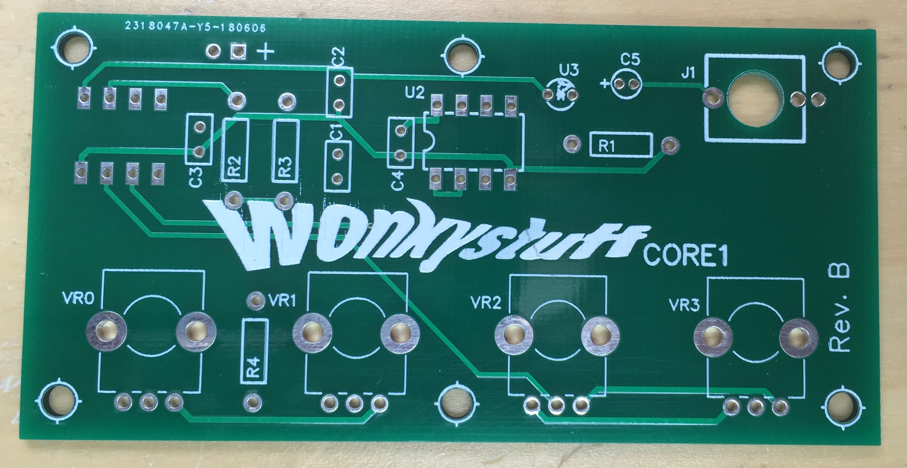
    1. Start with the resistors (R2, R3 and R4) taking care that they are placed correctly on the board. The legs of these should be bent at 90 degrees such that they line up with the holes in the PCB (the orientation of the resistors is not important).
    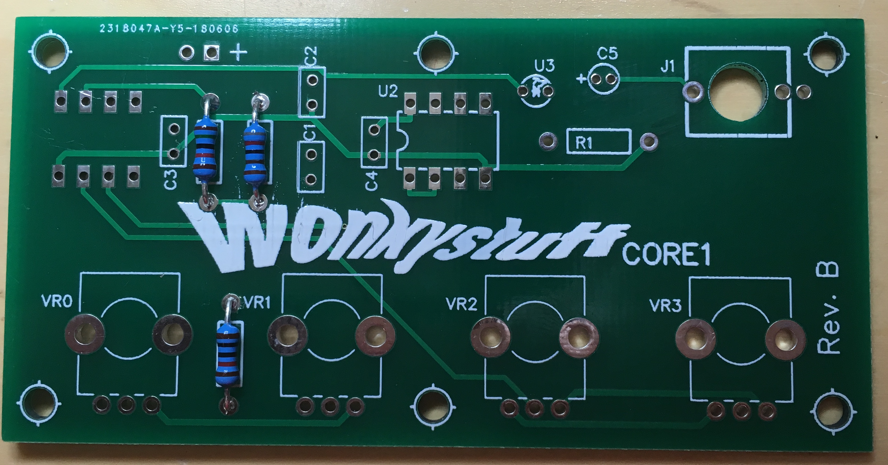

    1. Next add the small capacitors (C1, C2, C3 and C4) taking care that they are positioned correctly on the PCB. The legs should line up easily with the holes in the PCB (again, the orientation of these components is not important).
    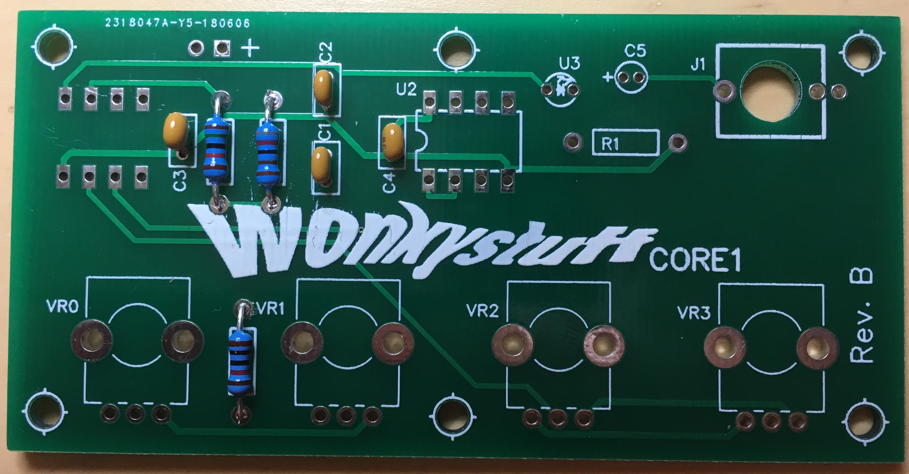

    1. Now solder the IC socket for U2, taking care to match the notch in the socket with the symbol on the PCB (it doesn't _actually_ matter, but it makes things easier when you get around to inserting the IC later).
    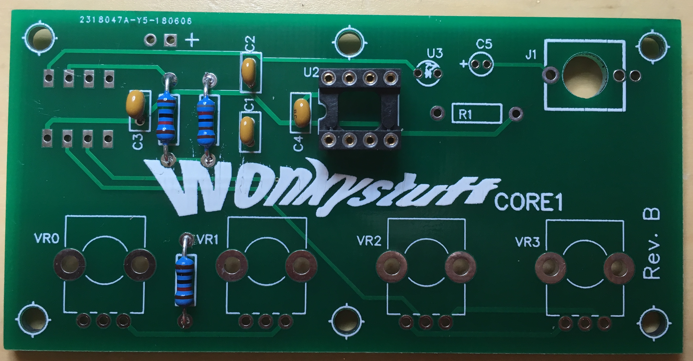

    1. Solder the electrolytic capacitor C5 onto the board -- make sure that it is inserted the right way round (The capacitor body usually indicates the negative pin with a stripe of `-`; the PCB indicates where the positive pin should be inserted).
    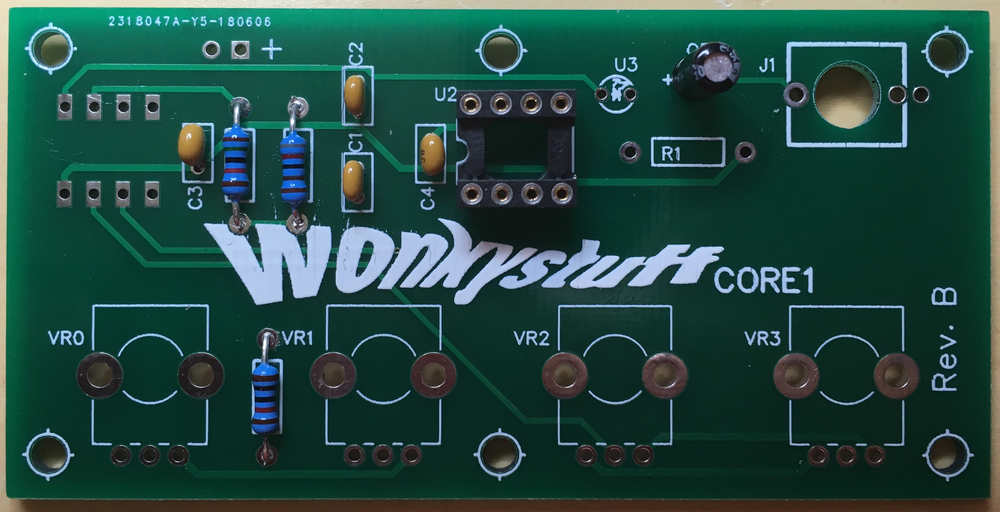

    1. Solder the audio jack J1 onto the PCB.
    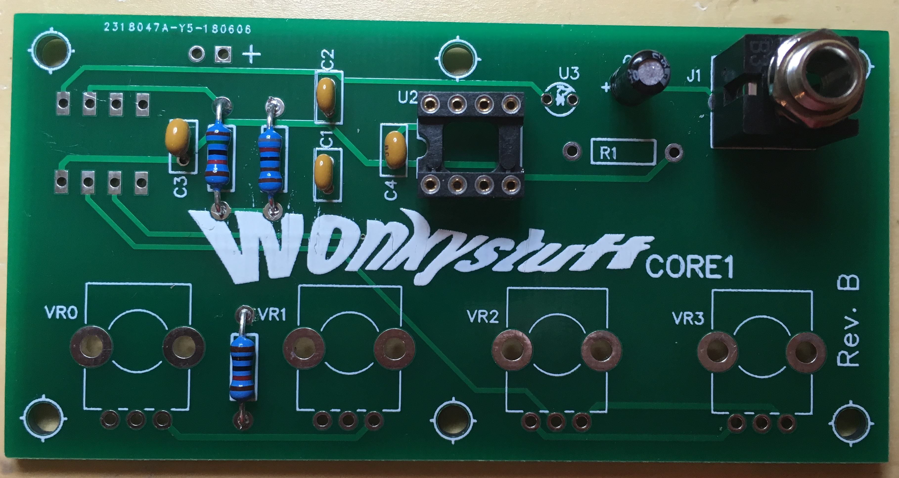

    1. In turn, insert the four potentiometers into place (the large tabs may need a slight squeeze for them to go into the holes correctly). The big tabs are there for mechanical support, so don't forget to solder them as well.
    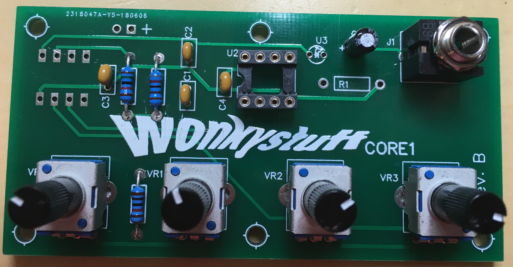

* Turn over the PCB:
    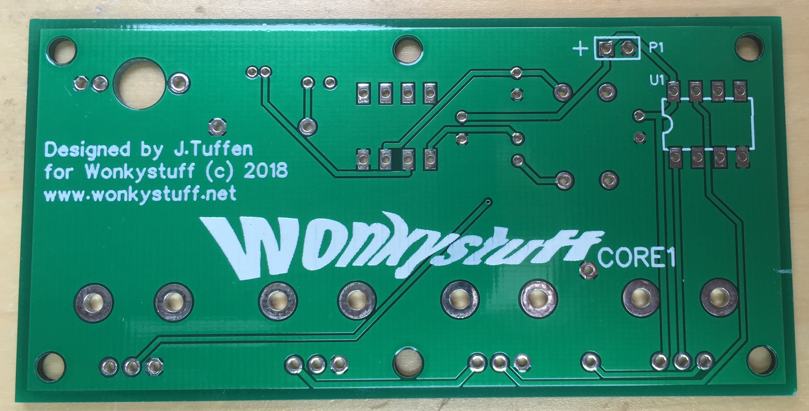
    1. Now solder the IC socket for U1, taking care to match the notch in the socket with the symbol on the PCB (it doesn't _actually_ matter, but it makes things easier when you get around to inserting the IC later).

    1. Solder the power connector so that it overlaps the PCB. If in doubt, attach the battery pack to the connector before soldering and make sure that the red wire matches the `+` symbol on the PCB. If desired, the power connector can be connected to the top side of the board -- in that case, there is only one way that it can fit!
    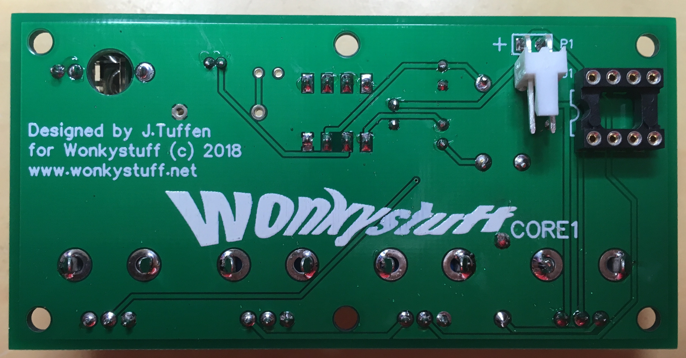

That's it for assembly -- give the soldering a look over to check for bad connections, short circuits etc. then insert U1 and U2 into their respective sockets (the legs may need a little squeeze to make them line up) making sure that the indicator for pin 1 (_either a **notch**, or an **indented dot**_) matches the orientation of the socket/PCB.

For reference, the PCB should now look something like this (please take note of the orientation of U1 and U2!):
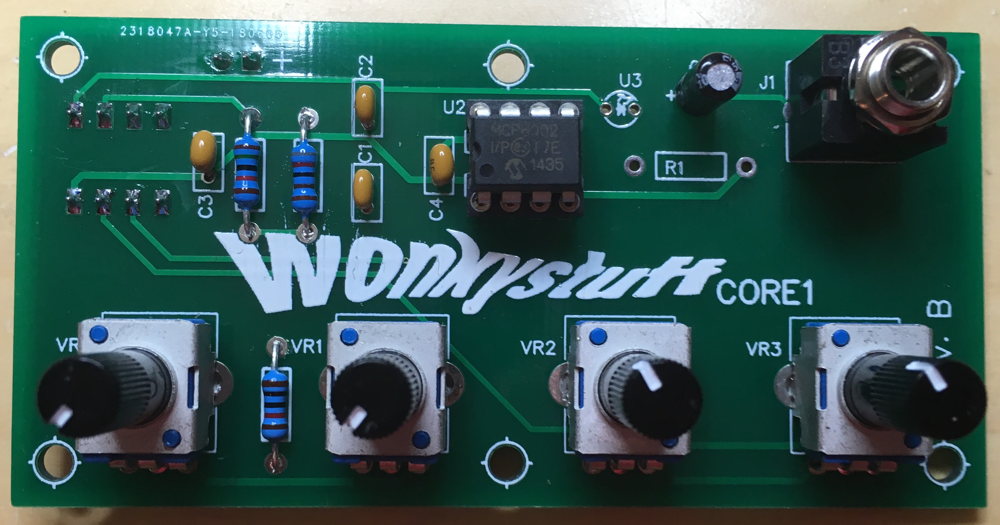
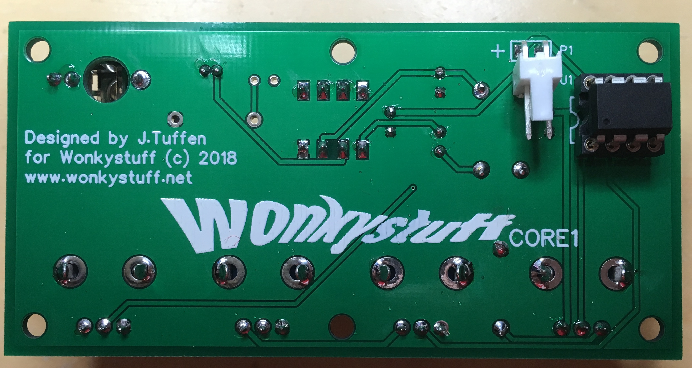

### Panel Design

There is no panel supplied with the kit, but each control is spaced at 20.3mm (0.8 inches), and the shaft of each control is 6mm diameter - a 7mm hole will provide sufficient clearance. The audio output is 24.2mm (0.95 inches) away from VR3, and again requires a 6mm hole.

### Mounting

The PCB can be mounted to a panel using 10mm M3 spacers; there are 6 mounting holes on the PCB to attach as suits.

## Sound!

The ATTiny85 comes pre-programmed with the **dr1.a** firmware (https://github.com/minimism/dr1a); a fairly simple drone synth capable of generating some quite nice sounds.

1. Insert 3 AAA batteries into the battery holder;
1. Connect the audio output to your audio device (e.g. a mixer);
1. Rotate all of the controls fully counter-clockwise;
1. Attach the battery pack to the board.

Now there should be a low-frequency sound coming from the output. Altering VR1 will change the waveform (there are 8 different shapes). VR2 changes the fundamental frequency, and VR3 changes the slave frequency - play about and see what sounds good. VR0 causes the waveform to change randomly - the frequency of change depends on how far clockwise VR0  is turned.

### Sound Engine Description

VR2 affects the frequency of oscillator 1, whilst VR3 affects the frequency of oscillator 2. Oscillator 2 is a wavetable oscillator whilst Oscillator 1 resets the phase of Oscillator 2 to zero every time that it cycles (this is basically what used to be called _hard sync_). If the frequencies are integer multiples then the output sound can be quite smooth, but richer sounds are heard when the oscillator frequencies are not harmonically related at all!

The sampling rate of the (8 bit PWM) output is 50kHz.

In the dr1.a firmware there are four basic wavetables available to oscillator 1, as well as four intermediate positions:
1. Sine
1. Sine + triangle
1. Triangle
1. Triangle + square
1. Square
1. Square + sawtooth
1. Sawtooth
1. Sawtooth + sine

If designing a panel, then the rotation of VR1 can be subdivided into 8 sections and labelled  as above.

# Hacking

Each of the potentiometers is simply responsible for sending a control voltage to the processor -- it is possible to modifiy the circuit so that any voltage source (within the range 0-4.5 volts) can be used to drive VR1-3. *VR0 is a special case, if a voltage less than 2 volts is applied here, then the processor will be reset; therefore it is not advisable to apply external control voltages to this input.*

**It goes without saying that it is possible to damage the chips by injecting too much voltage/current into the pins - proceed with caution!**
