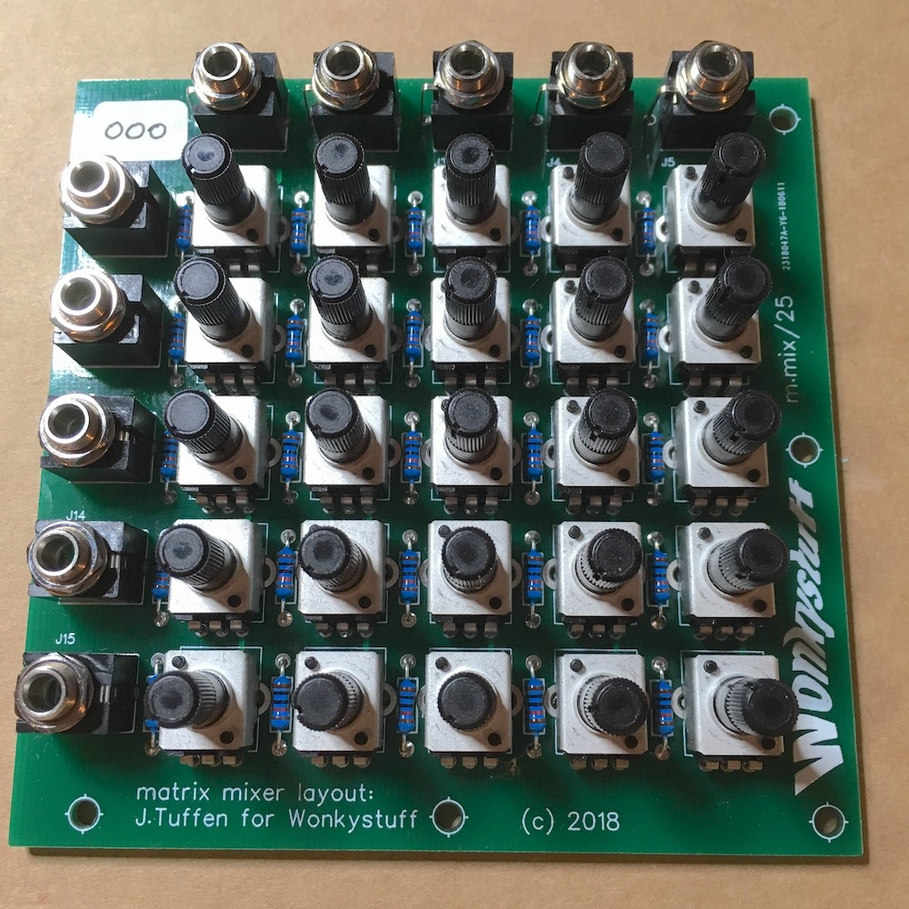

# WonkyStuff m.mix/25 Assembly Instructions

Thanks for buying the WonkyStuff **m.mix/25** micro-matrix-mixer. The mixer is a 5x5 passive matrix mixer designed to be as compact as possible.

_These instructions are a work in progress. If they are unclear, or you spot any mistakes, or you just want to say 'hello', please email us at info@wonkystuff.net. Alternatively message us via facebook or twitter_. Our website is http://wonkystuff.net/

There is a basic requirement that your soldering skills are up to scratch (I'm sure they are). If you need a reminder, you could do worse than to take a look at this soldering tutorial over at adafruit.com: https://learn.adafruit.com/adafruit-guide-excellent-soldering/

## Parts List

Before starting, make sure that you have all of the parts listed below. There are not many different components, so identification should be easy - but there are a lot of repetitions!

| Label  | Part | Description |
| --- | -- | ------ |
| J1-J5; J11-J15 | 3.5mm jack socket x10 | _Thonkiconn_ style |
| R11-R55 | 10k Resistor x25 | brown/black/black/red/brown stripes |
| VR11-VR55 | 100k Potentiometer x25 |  |
| - | PCB | a double-sided Printed Circuit Board |

You'll also need a soldering iron, some solder, a pair of wire cutters, pliers and a space to work in.

## Assembly

Assembly of this circuit is not complicated, but it is repetitive and accuracy is important! All components are added to the silk-screen printed side of the PCB (Basically assembly is done in height order).

1. Solder the 25 resistors in place - you might find it easier to pre-form the wires to match the hole-spacing on the PCB. Check the soldering for bridges and dry joints as you go, and snip the legs to avoid problems with short-circuiting later.
1. Solder the jack sockets. You may need to squeeze the open pin slightly to fit the PCB. Again, check for solder bridges and dry joints as you go.
1. Now it's the turn of the potentiometers. The most important thing here is alignment - make sure that the potentiometers are sat flush on the PCB and they should all line up nicely. For now, just solder the three pins, leaving the large tabs unsoldered until you know the mixer works (the large tabs may need a slight squeeze for them to go into the holes correctly).

That's it for assembly - give the soldering a look over to check for bad connections, short circuits etc. then try it out! As this is a passive circuit input signals can be 'hotter' than might be normal (but of course this is down to personal use-case and taste).

Sockets J1-J5 are inputs to the mixer, whilst sockets J11-J15 are outputs (although as this is a passive circuit, nothing will be damaged if connections are the other way around - you might even prefer the behaviour that way!)

Once you are happy that the circuit is working, the large tabs on the potentiometers can be soldered - they are there for mechanical support.

### Panel Design

There is no panel supplied with the kit, but each jack/control is spaced at 15.5mm (0.6 inches). The shaft of each control is 6mm diameter - a 7mm hole will provide sufficient clearance. The audio jacks are also 6mm, so a 7mm hole will work here as well. The PCB can be mounted to a panel using the jack sockets and 10mm M3 spacers; there are 6 mounting holes on the PCB to attach as required.

_Have fun, and thanks again for buying the kit!_
